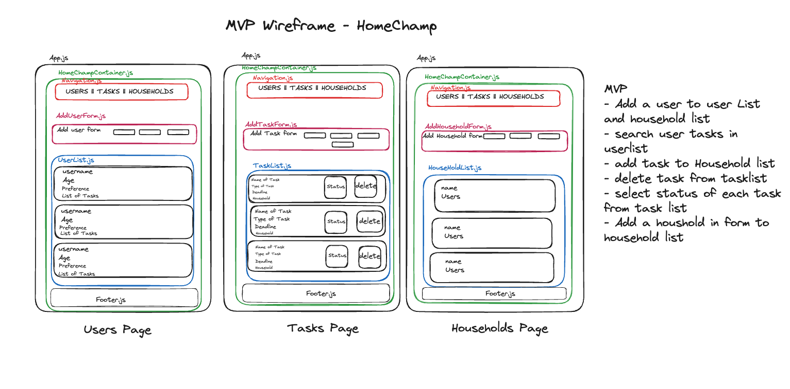
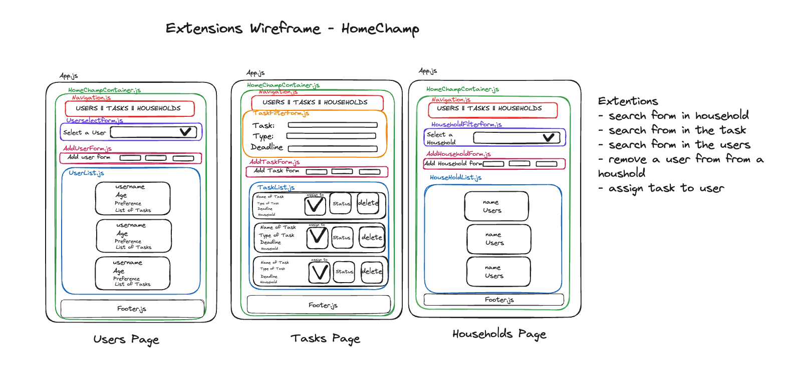

# HomeChamp To-do App by Taskmasters

The frontend of https://github.com/thomaspeace/backend_project_todo_app


## Project Aims
Our project aim is to create a client-side interactive application to organise your household task management, allowing you to keep track of tasks within your household. So you can turn your to-do into to-done!


## MVP

### Initial Approach

Planning:
* [x] Create Trello board to track tasks to do, completed tasks, and log errors [Trello Board](https://trello.com/b/pIYj6Las/frontend-project)
* [x] Create wireframe
* [x] Create component diagram

Users:
* [x] Admin can view user list
* [x] Admin can enter new user details

Tasks:
* [x] Admin can view task list
* [x] Admin can enter new task details
* [x] Admin can select status for each task
* [x] Admin delete tasks from task list

Households:
* [x] Admin can view Households
* [x] Admin can add a Households




## Extensions

### Initial Approach

Users:
* [x] Admin can search in the user list
* [x] Admin can remove user from a household

Tasks:
* [x] Admin can search in the task list
* [x] Admin can assign task to user

Households:
* [x]  Admin can search in the Households list




### Further Extensions for the Future

* [ ] Add categories and deadline
* [ ] Add a calendar
* [ ] Tracking/point system (scores)
* [ ] Summarise household tasks per user
* [ ] Setting recurrent tasks


### Installation

1. Clone the repository:

    ```bash
    git clone https://github.com/Sabah-bot/frontend_project_todo_app
    ```

2. Navigate to the project directory:

    ```bash
    cd HomeChamp
    ```

3. Install the dependencies:

    ```bash
    npm install
    ```


## Credits
|    |    Name     |         Github              |
|----|---------|---------------------------------|
| 🌍 | Dan     | https://github.com/Danash-Mahmood|
| 🍓 | Sabah   | https://github.com/Sabah-bot    |
| 🍄 | Aaron   | https://github.com/AaronAyeni   |


## Resources


## Licenses

[](https://opensource.org/licenses/MIT)
